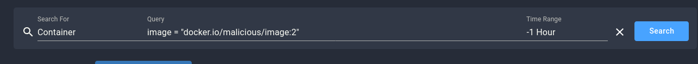
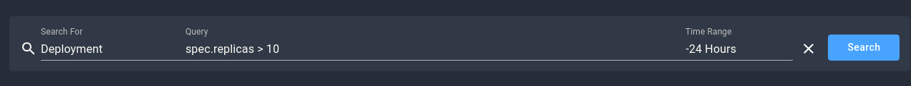

# Kubernetes-Specific Custom Flags

## Custom Flag: Suspicious CronJob Schedule

- **Name**: Suspicious CronJob Schedule
- **Schema**: CronJobs
- **Query**: Detect CronJobs scheduled to run unusually frequently (e.g., `schedule = "* * * * *"` indicating execution every minute).

- **Description**: Identify CronJobs running at unusually high frequencies, which may indicate misconfiguration or malicious intent, such as resource exhaustion or unauthorized tasks like cryptomining.
- **Severity**: Medium
- **Type**: Configuration Threat Detection
- **Impact**: Frequently scheduled CronJobs can overload system resources or allow continuous execution of malicious tasks, impacting system performance and security.
- **Content**:
  #### Summary
  Spyderbat detected a CronJob scheduled to run every minute, which may lead to resource exhaustion or indicate malicious activity.

  #### Information
  CronJobs scheduled to run too frequently can overwhelm system resources. Attackers might leverage such schedules for continuous execution of unwanted tasks like cryptomining or persistent data exfiltration.

  #### Action Steps
  1. Review the CronJob schedule and its intended purpose.
  2. Adjust the schedule to a more reasonable frequency if necessary.
  3. Investigate whether the schedule was tampered with maliciously.
- **Key Concepts**:  
  - **CronJobs**: Kubernetes objects used to run tasks at specified intervals. Malicious actors may schedule frequent jobs to overload resources or persistently execute unwanted tasks.

---

## Custom Flag: Unauthorized Access to Kubeconfig

- **Name**: Unauthorized Access to Kubernetes Secrets or Kubeconfig
- **Schema**: Processes
- **Query**: Monitor for unauthorized access or modification of kubeconfig files (`~/.kube/config`).

- **Description**: Attempt to access or modify Kubernetes secrets or the kubeconfig file found .
- **Severity**: Critical
- **Type**: Credential Threat Detection
- **Impact**: Unauthorized access or modification of the kubeconfig file may expose sensitive information and compromise the security of the entire Kubernetes cluster.
- **Content**:
  #### Summary
  Spyderbat detected an unauthorized access attempt to the kubeconfig file, which could lead to credential theft or privilege escalation.

  #### Information
  Accessing Kubernetes secrets or the kubeconfig file without authorization poses a severe risk, as it can expose sensitive data or allow unauthorized cluster control.

  #### Action Steps
  1. Investigate the source of the access attempt.
  2. Verify if the access was legitimate or a security breach.
  3. Rotate the affected credentials and monitor for further access attempts.
- **Key Concepts**:  
  - **Kubeconfig**: A configuration file used to access and manage Kubernetes clusters. Unauthorized access to this file can compromise cluster security.

---

## Custom Flag: Unapproved Container Images

- **Name**: Unapproved Container Images
- **Schema**: Containers
- **Query**: Detect containers using images pulled from unauthorized or unknown container registries, especially public registries lacking security validation.

- **Description**: containers running images from unapproved or untrusted sources.
- **Severity**: High
- **Type**: Image Threat Detection
- **Impact**: Running containers with unapproved images can compromise security by introducing vulnerabilities, malicious software, or allowing unauthorized access, potentially leading to data loss or service disruption.
- **Content**:
  #### Summary
  Spyderbat detected a container using an image from an unapproved or unknown registry, which may introduce security risks.

  #### Information
  Using unapproved container images may expose your environment to vulnerabilities or malware, especially if pulled from public registries lacking robust security measures.

  #### Action Steps
  1. Investigate the image source and verify its integrity.
  2. Limit container image usage to trusted registries.
  3. Implement scanning and validation of images before deployment.
- **Key Concepts**:  
  - **Container Registries**: Repositories where container images are stored and distributed. Public registries may pose security risks if they allow unverified images.  
  - **Image Integrity**: Critical for preventing supply chain attacks, image validation ensures that the images used are secure, free of malicious content, and have not been altered.  
  - **Trusted Registries**: Private or approved registries that enforce security measures, such as image scanning, signature validation, and version tracking, to protect against threats and vulnerabilities.

---

## Custom Flag: Deployment with High Replica Count

- **Name**: Deployment with High Replica Count
- **Schema**: ReplicaSet or StatefulSet
- **Query**: Identify ReplicaSets or StatefulSets where the replica count exceeds a specified threshold (e.g., more than 10 replicas).

- **Description**: Deployment with unusually high replica counts found.
- **Severity**: Medium
- **Type**: Resource Usage Threat Detection
- **Impact**: Deployments with high replica counts can indicate overprovisioning, inefficient resource use, or misconfigurations, potentially leading to system performance degradation or resource exhaustion.
- **Content**:
  #### Summary
  Spyderbat detected a deployment with a high replica count, which may indicate scaling issues or misconfiguration.

  #### Information
  Deploying too many replicas can overwhelm your infrastructure, leading to resource exhaustion, performance issues, or unexpected downtime.

  #### Action Steps
  1. Review the replica count and verify if it aligns with expected workload demands.
  2. Adjust the deployment scaling parameters to optimize resource utilization.
  3. Investigate whether this configuration was due to an error or deliberate action.
- **Key Concepts**:  
  - **ReplicaSet**: A Kubernetes controller that ensures a specified number of pod replicas are running at all times.  
  - **StatefulSet**: A Kubernetes controller for managing stateful applications, where each replica has a stable identity.  
  - **High Replica Count**: May signal issues such as overprovisioning, unexpected traffic, or improper scaling rules, which could degrade system performance.
